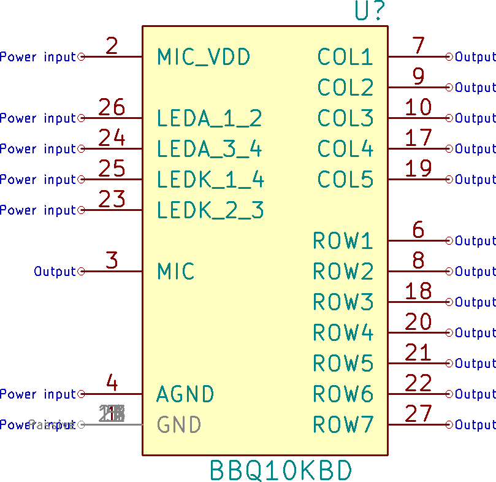
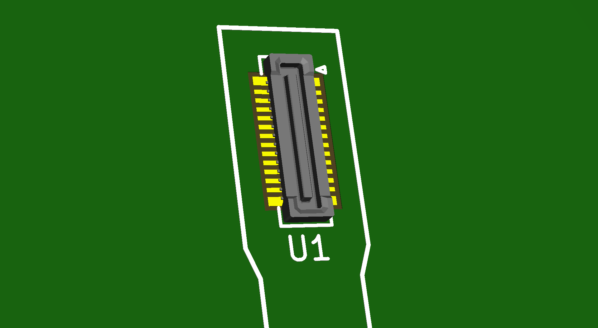
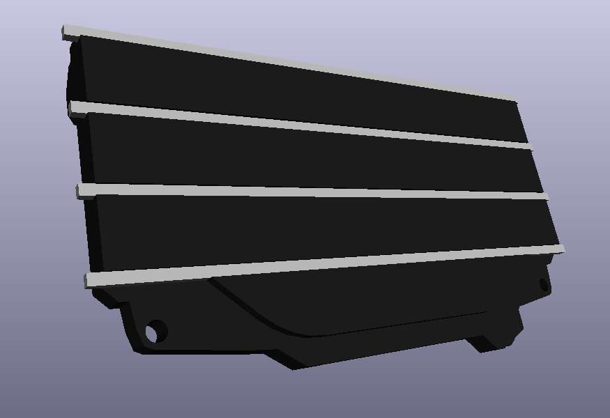
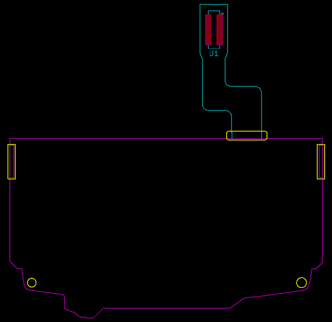

# Blackberry Q10 Keyboard

This document tries to summarize all the findings about the Blackberry Q10 keyboard, which seems interesting for DIY projects.
The keyboard has a nice feel to it, is just the right size for typing and is fairly cheap (around 3 USD on Aliexpress).  
It also has a 4 LED backlight and a built-in MEMS microphone which can come in handy.

### Reversing on the pinout

Most of the work was done by others in [2] and [1], but after discovering the microphone, I was curious to see how it was connected and get the complete pinout of the keyboard. The flex PCB inside the keyboard is covered with a black film, but it is possible to remove the film by lifting a edge with a scalpel and slowly peeling it off, it might break mid-way but you can just lift the corner and continue.

A high resolution scan of the flex is available in this respository in `flex_scan.png`

Pinout:
| | | | | |
|-|-|-|-|-|
| GND     |  1 | \| | 28 | GND        |
| MIC_VDD |  2 | \| | 27 | ROW7       |
| MIC     |  3 | \| | 26 | LEDA 1 & 2 |
| AGND    |  4 | \| | 25 | LEDK 1 & 4 |
| GND     |  5 | \| | 24 | LEDA 3 & 4 |
| ROW1    |  6 | \| | 23 | LEDK 2 & 3 |
| COL1    |  7 | \| | 22 | ROW6       |
| ROW2    |  8 | \| | 21 | ROW5       |
| COL2    |  9 | \| | 20 | ROW4       |
| COL3    | 10 | \| | 19 | COL5       |
| GND     | 11 | \| | 18 | ROW3       |
| GND     | 12 | \| | 17 | COL4       |
| GND     | 13 | \| | 16 | GND        |
| GND     | 14 | \| | 15 | GND        |
| | | | | |

Since the numbering can be confusing (is it the plug or the receptacle?), see footprint below for clarification.

### KiCad resources

NOTE: These are not yet tested and while they are based on other people's working prototypes, I can't give a 100% guarantee these are correct, once I receive my board and verify everything, I will modify the document to reflect my findings.

Here is the final schematic symbol with the complete pinout, only one GND is visible, the rest is stacked under it and set to be invisible.

The receptacle for the keyboard connector is the Hirose BM14B(0.8)-24DS-0.4V(53), the datasheet is freely available and Hirose even offers a 3d model of the connector, if you like it.

There's also a 3d model of the keyboard itself which I took from [4] and converted to wrl.

I have a outline of the keyboard with the holes for tabs, but I haven't created a proper footprint file for it yet, will add in the near future:

### Column/Row to key matrix

|          | COL1 | COL2 | COL3 | COL4 | COL5 | 
|----------|------|------|------|------|------| 
| **ROW1** | Q    | E    | R    | U    | O    |
| **ROW2** | W    | S    | G    | H    | L    |
| **ROW3** | sym  | D    | T    | Y    | I    |
| **ROW4** | A    | P    | R ⇧  | ↵    | ⌫   |
| **ROW5** | alt  | Z    | V    | B    | $    |
| **ROW6** | spac | X    | C    | N    | M    |
| **ROW7** | 🎤   | L ⇧  | F    | J    | K    |

Copied from [3].

### Acknowledgements / Thanks

Huge thanks to JoeN for doing the initial reversing of the keyboard and finding the proper connector, and to WooDWorkeR for finding the backlight pinout and indirectly getting me interested in this keyboard in the first place.  
Also thanks to ccadic for providing the 3d model of the keyboard.

### Sources

[1] https://hackaday.io/project/27520-pimp-personal-information-manager-pager  
[2] https://www.eevblog.com/forum/beginners/how-to-connect-to-a-very-very-challanging-blackberry-q10-keyboard-connector/  
[3] https://forum.arduino.cc/index.php?topic=355709.0  
[4] https://grabcad.com/library/blackberry-q10-keyboard-shape-1  
[5] https://www.hirose.com/product/en/products/BM14/BM14B%280.8%29-24DS-0.4V%2853%29/  